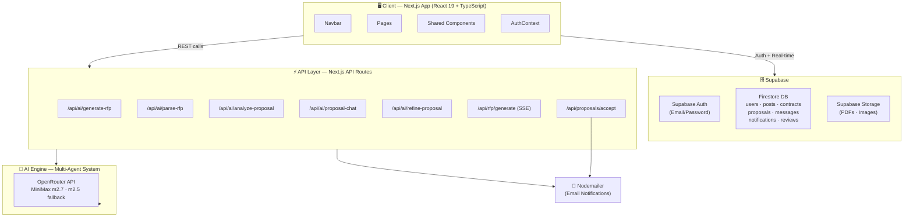
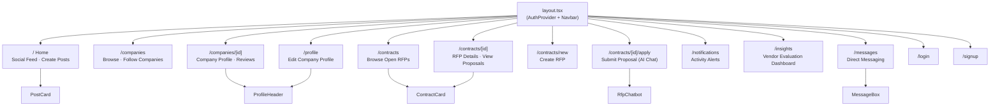
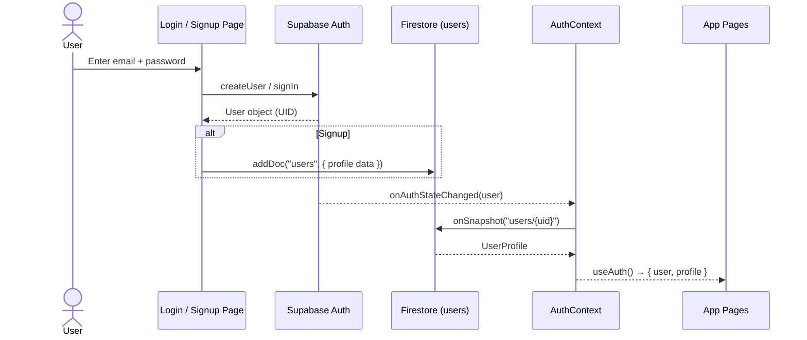
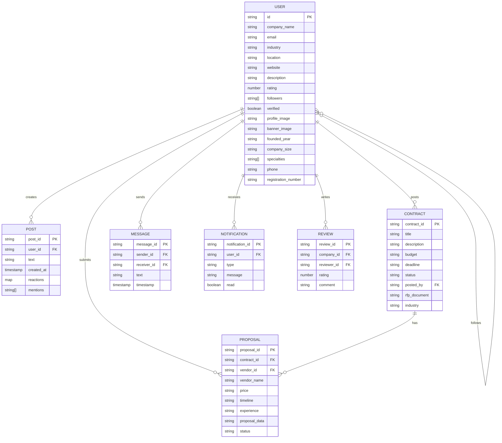
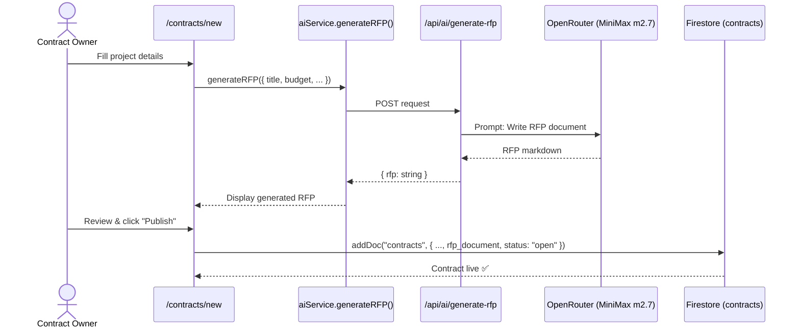
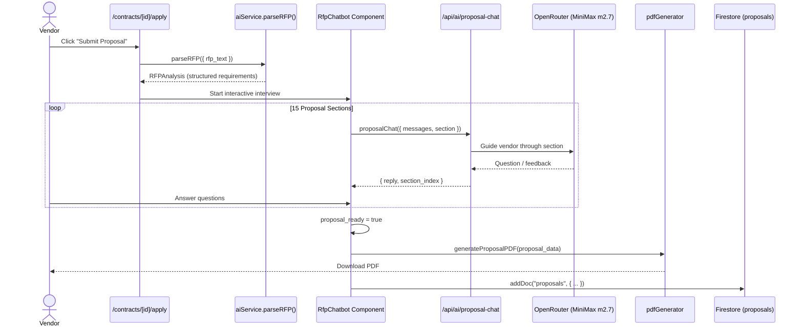
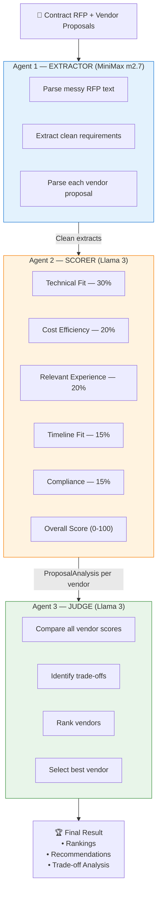
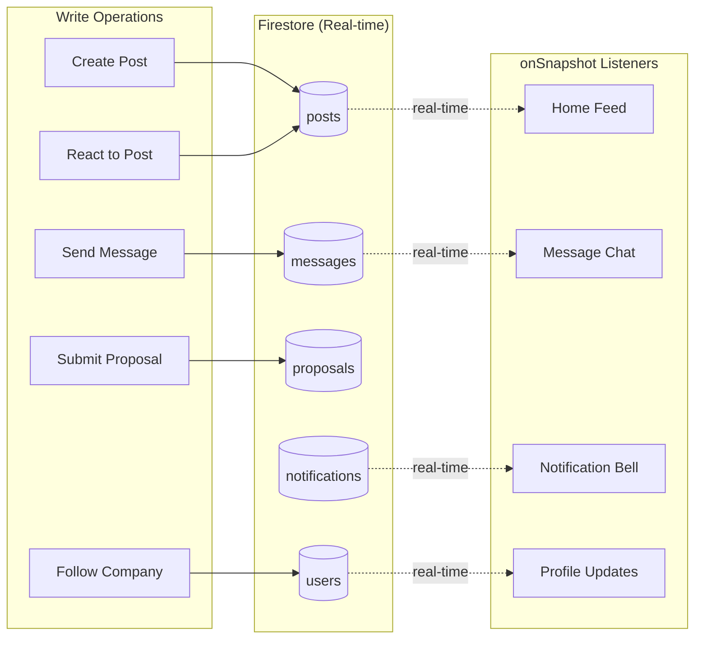
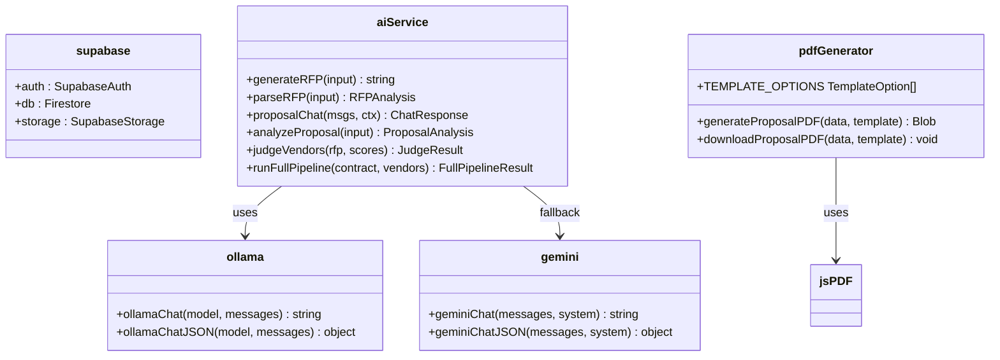
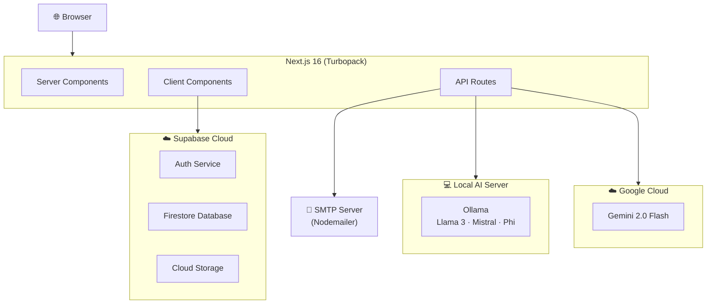

# ProcureLink — System Architecture (UML)

> **Tech Stack:** Next.js 16 · React 19 · TypeScript · Tailwind CSS 4 · Supabase (Auth + PostgreSQL + Storage) · OpenRouter (MiniMax m2.7 + m2.5 fallback) · Nodemailer · jsPDF

---

## 1. High-Level System Architecture

---

## 2. Page & Component Structure

---

## 3. Authentication Flow

---

## 4. Data Model (Entity Relationships)

---

## 5. RFP Creation Flow

---

## 6. Vendor Proposal Submission Flow

---

## 7. AI Multi-Agent Evaluation Pipeline

---

## 8. Real-Time Data Flow

---

## 9. Services Layer

---

## 10. Deployment Architecture

